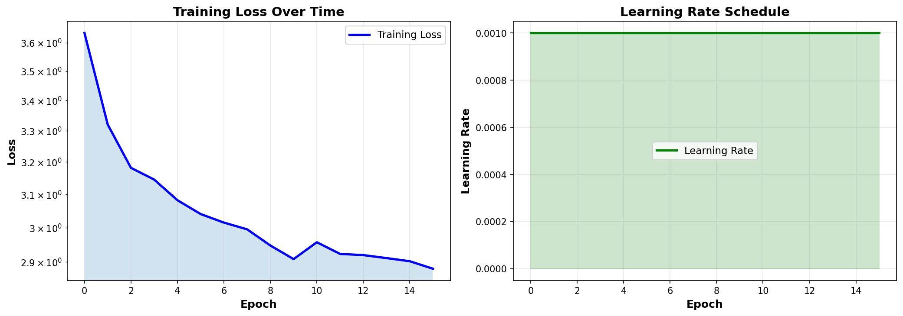
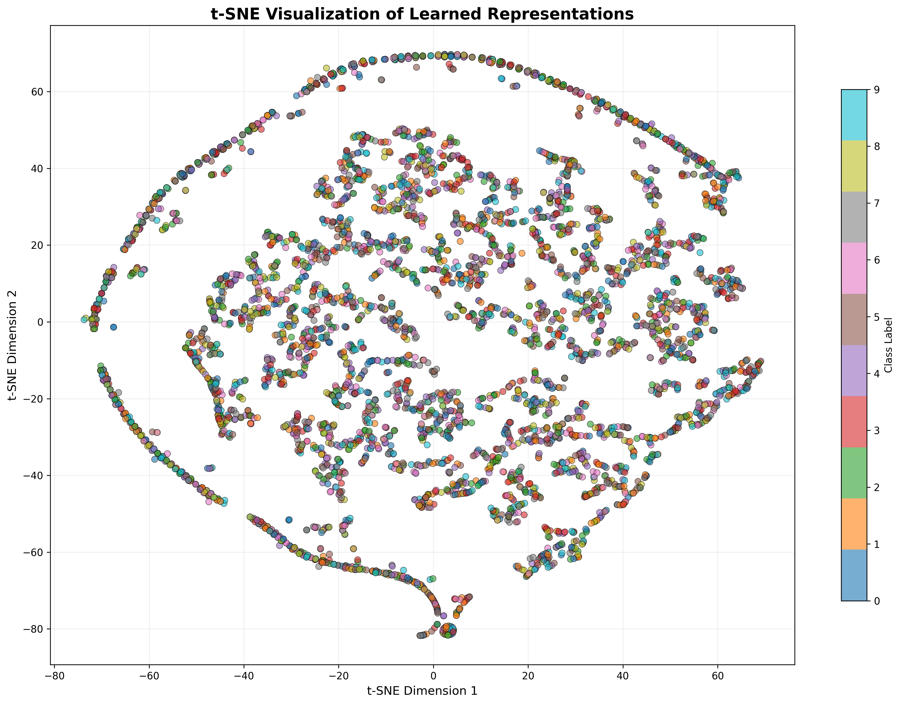

# Satellite Self-Supervised Learning with SimCLR
## Training Curves



## Feature Embedding Visualization (t-SNE)




**Learn powerful representations from unlabeled satellite imagery using contrastive learning**

[](https://www.python.org/)
[](https://pytorch.org/)
[](https://opensource.org/licenses/MIT)

## What This Does

A complete **SimCLR** self-supervised learning implementation for satellite imagery, adapted for multi-channel data (Sentinel-2, RGB, etc.). Train on unlabeled satellite data to learn representations that work great for classification, anomaly detection, and change detection.

### Why Satellite SSL?

| Challenge | Solution |
|-----------|----------|
| Labels expensive | Learn from unlabeled satellite streams |
| Data scarce | Pre-train globally, fine-tune locally |
| Multi-sensor | Unified representation (RGB, Sentinel-2, etc.) |
| Massive scale | Process millions of images efficiently |

## Quick Start (3 Options)

### Option 1: Google Colab (FREE GPU)
```bash
1. Download → COLAB_COMPLETE.ipynb
2. Go to colab.research.google.com
3. Upload notebook
4. Run cells top to bottom
5. Download results
```
**30-45 minutes**

### Option 2: Local Machine
```bash
git clone <repo>
cd satellite-ssl
python -m venv venv && source venv/bin/activate
pip install -r requirements.txt
python src/train.py --epochs 50 --batch-size 128
```

### Option 3: One Command
```bash
chmod +x scripts/run_experiment.sh
./scripts/run_experiment.sh
```

## Project Structure

## How It Works

### Training Pipeline
```
Satellite Image
    ↓
  [Augment 1] → ResNet → Projection Head ┐
                                          → NT-Xent Loss
  [Augment 2] → ResNet → Projection Head ┘
```

**Core Idea:** Maximize similarity between augmented views of same image

### NT-Xent Loss
- Positive pairs: Same image, different augmentations
- Negative pairs: Different images in batch (10K+ per batch)
- Temperature scaled for numerical stability

## Configuration

Edit `src/config.py` to customize:

```python
# Data
image_size = 64               # Input resolution
num_channels = 3              # RGB (or 13 for Sentinel-2)
num_classes = 10              # Downstream tasks

# Training  
batch_size = 128              # Larger = better contrastive signal
num_epochs = 50               # Usually sufficient
learning_rate = 0.001        # SGD with momentum
temperature = 0.07           # NT-Xent parameter

# Model
backbone = "resnet18"         # or "resnet50"
projection_dim = 128          # Output dimension
hidden_dim = 2048             # Hidden layer size
```

## 📊 Expected Results

| Metric | Value |
|--------|-------|
| **Training Time** | 30-45 min (T4 GPU), 5 min (A100) |
| **Loss Curve** | 2.5 → 0.8 (smooth convergence) |
| **Linear Probe** | 50-60% accuracy (EuroSAT 10-class) |
| **Parameters** | 11.2M (ResNet18) / 23.5M (ResNet50) |
| **Memory** | ~4GB on T4 GPU |

## 🌍 Applications

- **Climate Monitoring:** Deforestation, sea ice, crop health
- **Disaster Response:** Rapid damage assessment
- **Change Detection:** Urban growth, infrastructure
- **Scientific Research:** Anomaly detection, pattern discovery

## Dependencies

```
torch==2.0.0
torchvision==0.15.0
numpy, scikit-learn, matplotlib
pandas, tqdm, Pillow
```

Full list in `requirements.txt`

## FAQ

**Q: Do I need a GPU?**  
A: Highly recommended. CPU works but ~10x slower. Google Colab T4 is free!

**Q: Can I use custom satellite data?**  
A: Yes! Edit `src/dataset.py` to add your custom dataset class.

**Q: Multi-spectral (13-channel) support?**  
A: Edit first conv layer in `model.py` to change input channels.

**Q: How to use pre-trained model?**  
A: `features = model.get_features(images)` → 2048-dim vectors ready for downstream tasks.

**Q: Training too slow?**  
A: Reduce batch size → reduce image size → use Google Colab GPU


